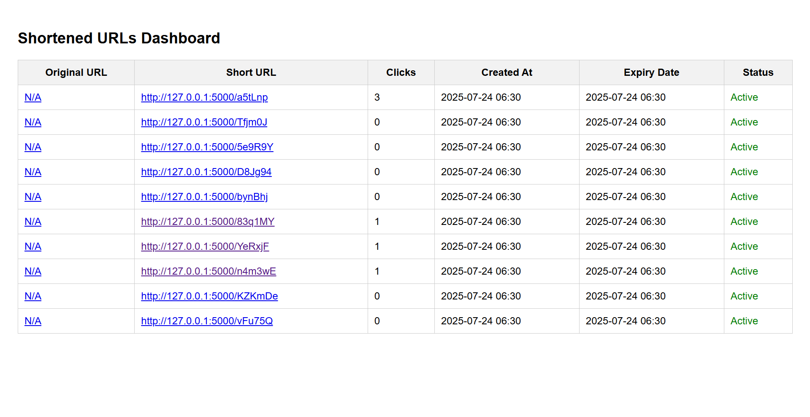

# 🔗 Scalable URL Shortener with Analytics

A scalable and production-ready URL shortening service built using **Flask**, **MongoDB**, and **Render**, featuring:

- ✅ Custom short URLs
- 📈 Click tracking analytics
- ⏳ Expiry-based link handling
- 📊 Dashboard for real-time monitoring

---

## 🚀 Features

- **Shorten long URLs** into compact short codes
- **Track click counts** on shortened links
- **Set expiration dates** for links
- **RESTful API** design for integration
- **Dashboard** for monitoring usage & expiry status
- **Deployed with HTTPS** on Render

---

## 🧰 Tech Stack

- **Backend**: Flask (Python)
- **Database**: MongoDB (via MongoDB Atlas)
- **Frontend**: HTML/CSS/JS for Dashboard
- **Deployment**: Render (Free Tier)

---

## 📦 API Endpoints

| Method | Endpoint | Description |
|--------|----------|-------------|
| `POST` | `/shorten` | Shorten a long URL |
| `GET`  | `/<short_code>` | Redirect to original URL |
| `GET`  | `/dashboard/data` | Get all URLs with analytics |

---

## 📊 Dashboard Preview

> Shows all shortened URLs with their clicks, creation date, expiry status.

 <!-- Replace with actual image or remove -->

---

## ⚙️ Setup Instructions

### 1. Clone the repo

'bash'
git clone https://github.com/your-username/url-shortener.git
cd url-shortener

### 2. Install dependencies"# URL-SHORTENER" 

pip install -r requirements.txt

### 3. Set up environment
Create a .env file (or set environment variable) for MongoDB:

MONGO_URI = your_mongodb_atlas_uri

### 4. Run the app

python main.py

# 🌐 Deployed URL

Live at: https://your-app-name.onrender.com

# 👨‍💻 Author
GEETIKA SINGH
4th Year BTech CSE | Bennett University
LinkedIn | GitHub

## 📄 License

This project is licensed under the [MIT License](./LICENSE).

